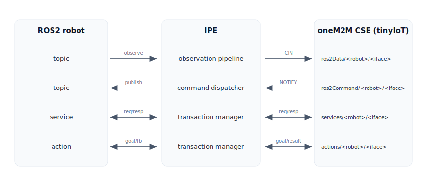

# oneM2M-based Interworking Proxy Entity (IPE)

A generic Interworking Proxy Entity (IPE) that bridges ROS2 robots to a oneM2M CSE (tinyIoT). It maps the topics, services, and actions a robot publishes onto oneM2M resources, and relays commands received over oneM2M back to the robot. Message types are not hardcoded — a single **yaml configuration** connects anything from a single robot to a multi-robot fleet.

- **Type-agnostic**: Converts arbitrary message types to canonical JSON via rosidl reflection. Not tied to any firmware.
- **Declarative config**: yaml — not code — defines what maps to which oneM2M resource. A single pattern rule expands across N robots.
- **Lossless & recoverable**: Every message ends in a oneM2M operation or a status event. State is recovered across restarts and CSE outages.

> Detailed design and rationale live in `docs/design/DESIGN.md` (v3). This README covers installation, configuration, and operation.

---

## Overview

The IPE sits between the ROS2 graph and the oneM2M CSE, relaying messages in both directions.



Each ROS2 interface maps to one of four subtrees under the oneM2M AE.

| Subtree | Direction | Purpose |
|---|---|---|
| `ros2Data/<robot>/<iface>/` | ROS2 → oneM2M | Observed topic data |
| `ros2Command/<robot>/<iface>/` | oneM2M → ROS2 | Command topics (a value an app writes to the CSE is published to the robot by the IPE) |
| `services/<robot>/<iface>/` | Bidirectional | Service request/response |
| `actions/<robot>/<iface>/` | Bidirectional | Action goal/feedback/result |

The default layout places a per-robot segment under a single shared AE (`<AE>/ros2Data/<robot_id>/...`). To give each robot its own AE, enable `ae_per_robot`.

---

## Requirements

- Python 3.10 or later, Linux
- ROS2 — `rclpy` comes from a ROS2 distribution (e.g. Humble), not pip
- A running tinyIoT CSE

The pip dependencies are just `pyyaml`, `requests`, and `cerberus`, installed automatically. `--explain`, which only validates the config, runs without ROS2; actual bridging and `--discover` require an active ROS2 environment.

---

## Installation

```bash
source /opt/ros/humble/setup.bash   # provides rclpy
pip install .                        # base
pip install ".[notification]"        # with the notification listener (flask)
```

Installing registers the `ipe` console command.

---

## Quick start

```bash
# 1. Inspect the ROS2 graph — list mappable topics/services/actions
ipe --config config/profiles/px4.yaml --discover

# 2. Validate the config — print the bridge plan only, no CSE/ROS2 needed
export IPE_CSE_ORIGIN=Cipe
ipe --config config/profiles/px4.yaml --explain

# 3. Provision CSE resources (add --reset to recreate)
ipe --config config/profiles/px4.yaml --bootstrap-only

# 4. Run
ipe --config config/profiles/px4.yaml
```

`--explain` checks that the config resolves as intended. It prints which oneM2M path and QoS each interface connects with.

---

## Configuration — connecting a robot via yaml

A config file begins with `schema_version: 2`. One file describes one deployment and can hold a single robot or many.

```yaml
schema_version: 2
cse: { endpoint: http://localhost:3000, cse_base: TinyIoT, ae_name: ros2-ipe, origin: "${IPE_CSE_ORIGIN}", rvi: "3" }
robots: [ ... ]          # robot list
discovery: { ... }       # interface discovery policy
qos_profiles: { ... }    # named QoS presets (required, at least one)
bridge:                  # interfaces to map
  topics: [ ... ]
  services: [ ... ]
  actions: [ ... ]
```

### Declaring robots

```yaml
robots:
  - { id: tb3, namespace: "" }       # single robot, no namespace
  - { id: r1,  namespace: /robot1 }  # robot with a namespace
```

- `id` — the robot's root segment in the oneM2M path (`ros2Data/<id>/...`).
- `namespace` — the prefix that determines which robot an interface belongs to.

If you have a single robot and topic names carry no namespace, you can omit `robots` (a `default` robot is registered automatically).

### Selecting interfaces

Each `bridge` entry targets an interface with either `name` (exact name) or `match` (pattern).

```yaml
bridge:
  topics:
    - name: /tb3/scan          # a single topic
    - match: "/{robot}/odom"   # pattern: applies to every robot's odom
```

A `{robot}` pattern auto-expands a single rule across the N robots found via discovery (`path: "{robot}/odom"` separates each robot's subtree). `discovery.mode` sets the discovery scope.

| mode | Mapped targets |
|---|---|
| `config-only` | Only entries declared with `name` (each requires a `type` pin) |
| `hybrid` (default) | Declared entries + discovered interfaces captured by a `match` pattern |
| `auto-expose` | All discovered interfaces passing `allow`/`deny` |

### Topic options

```yaml
- name: /tb3/battery_state
  direction: observe          # observe(robot→CSE) | command(CSE→robot) | both
  representation: latest       # latest | historical | both | sampled(downsample)
  qos: sensor_data             # preset name or { profile: ..., depth: 1 }
  sample: { min_interval_ms: 1000 }              # when representation: sampled
  filter: { type: delta, fields: [voltage], min_change: 0.05 }   # optional
  source_ts: { field: header.stamp, format: ros_time }           # extract source timestamp
```

### Command topics (safety)

Commands are how an external application drives the robot, so they are disabled by default and must be explicitly enabled.

```yaml
- name: /tb3/cmd_vel
  direction: command
  qos: reliable
  access: { enabled: true, confirm: required }   # enable + manual approval
  command:
    rate_limit_hz: 10            # publish rate cap
    max_age_ms: 3000             # commands older than 3s expire
    watchdog_ms: 500             # stop command if updates stall
    clamp: { "linear.x": [-0.22, 0.22] }   # clamp field value range
```

### Services & actions

```yaml
services:
  - { name: /tb3/reset, type: std_srvs/srv/Empty, timeout_ms: 5000 }
actions:
  - name: /tb3/navigate_to_pose
    type: nav2_msgs/action/NavigateToPose
    feedback: sampled            # log | latest | sampled | combined
    goal_fields: [pose]
    result_fields: [result]
```

### Example — single robot

```yaml
schema_version: 2
cse: { endpoint: http://localhost:3000, cse_base: TinyIoT, ae_name: ros2-ipe, origin: "${IPE_CSE_ORIGIN}", rvi: "3" }
robots:
  - { id: tb3, namespace: "" }
discovery: { mode: config-only, deny: ["/rosout", "/tf", "/tf_static"], refresh_sec: 5 }
qos_profiles:
  sensor_data: { reliability: best_effort, depth: 5 }
  reliable:    { reliability: reliable, depth: 10 }
bridge:
  topics:
    - { name: /scan, type: sensor_msgs/msg/LaserScan, direction: observe, representation: latest, qos: sensor_data }
    - name: /cmd_vel
      type: geometry_msgs/msg/Twist
      direction: command
      qos: reliable
      access: { enabled: true, confirm: required }
      command: { rate_limit_hz: 10, max_age_ms: 3000, clamp: { "linear.x": [-0.22, 0.22] } }
```

### Example — multi-robot (fleet)

```yaml
schema_version: 2
cse: { endpoint: http://localhost:3000, cse_base: TinyIoT, ae_name: ros2-ipe, origin: "${IPE_CSE_ORIGIN}", rvi: "3" }
robots:
  - { id: r1, namespace: /robot1 }
  - { id: r2, namespace: /robot2 }
robots_strict: false           # dynamically register unknown robots too (true to reject)
discovery: { mode: hybrid, allow: ["/robot*/**"], deny: ["/rosout", "/tf", "/tf_static"], refresh_sec: 5 }
qos_profiles:
  sensor_data: { reliability: best_effort, depth: 5 }
  reliable:    { reliability: reliable, durability: transient_local, depth: 1 }
bridge:
  topics:
    - { match: "/{robot}/odom", direction: observe, representation: sampled, sample: { min_interval_ms: 1000 }, path: "{robot}/odom", qos: reliable }
    - { match: "/{robot}/scan", direction: observe, representation: latest, path: "{robot}/scan", qos: { profile: sensor_data, depth: 1 } }
    - match: "/{robot}/cmd_vel"
      direction: command
      type: geometry_msgs/msg/Twist
      path: "{robot}/cmd_vel"
      access: { enabled: true, confirm: required }
      command: { rate_limit_hz: 10, max_age_ms: 3000 }
```

To add a robot, append an entry to `robots` and make sure the `allow` glob covers its namespace. The topic rules need no change thanks to the `{robot}` capture.

### Common errors

| Symptom | Cause / fix |
|---|---|
| Fails immediately at boot | `schema_version` is not `2`, or missing |
| `must have exactly one of 'name' or 'match'` | A bridge entry must specify exactly one of `name`/`match` |
| Missing type under config-only | `name` entries under `config-only` require a `type` pin |
| Fails on unset env var | The value is exactly `${VAR}` but the variable isn't exported (partial interpolation unsupported) |
| QoS preset undefined | `qos: name` is not in `qos_profiles` |
| Path collision | Final oneM2M paths overlap — disambiguate with `path`/`alias`/`{robot}` |

For the full set of config keys, allowed values, and defaults, see `docs/design/DESIGN.md`.

---

## CLI

```
ipe --config <file> [options]
```

| Flag | Action |
|---|---|
| `--config, -c` | Config file path (required) |
| `--log-level` | `DEBUG`/`INFO`/`WARNING`/`ERROR` (default INFO) |
| `--explain` (`--dry-run`) | Resolve the config and print the bridge plan only (no ROS2/CSE) |
| `--discover` | Print a one-shot ROS2 graph snapshot |
| `--bootstrap-only` | Provision CSE resources (AE/CNT/SUB) only |
| `--reset` | Delete existing AEs before provisioning |

---

## Example profiles

The repository ships `config/profiles/px4.yaml` (a real-stack PX4 SITL + uXRCE-DDS example). For PX4, copy this file and just adjust the actual topic names you see from `ros2 topic list`. For a single robot or a fleet, copy the snippets above to get started.
