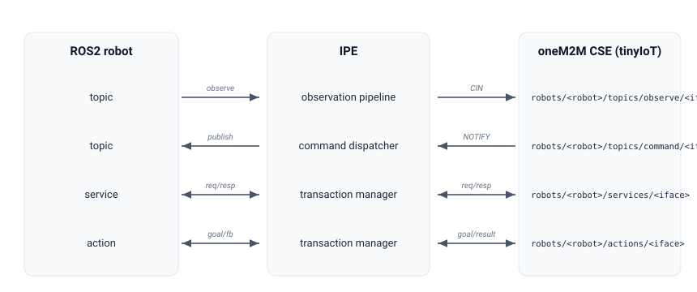

# oneM2M-based Interworking Proxy Entity (IPE)

A generic Interworking Proxy Entity that discovers a live ROS 2 graph and bridges its topics, services, and actions to a oneM2M CSE such as tinyIoT. Interface names, types, directions, robot namespaces, and endpoint QoS come from DDS discovery; deployment profiles and YAML files are not used.

- **Discovery-driven**: the running ROS 2 graph is the source of truth.
- **Type-agnostic**: arbitrary ROS messages are converted to canonical JSON through rosidl reflection.
- **Continuously reconciled**: interfaces are added and removed as the graph changes.
- **Recoverable**: state and pending work survive process and CSE outages.

## Overview

The IPE maps discovered interfaces under one shared AE:

| Subtree | Direction | Purpose |
|---|---|---|
| `robots/<robot>/ros2Data/<iface>/` | ROS 2 → oneM2M | Observed topic data |
| `robots/<robot>/ros2Command/<iface>/` | oneM2M → ROS 2 | Command topics |
| `robots/<robot>/services/<iface>/` | Bidirectional | Service request and response |
| `robots/<robot>/actions/<iface>/` | Bidirectional | Action goal, feedback, and result |



ROS infrastructure topics (`/rosout`, `/parameter_events`), parameter services, and hidden action internals are excluded automatically. Namespaced endpoint ownership creates robot boundaries. For a graph without robot namespaces, `--robot-id` supplies the fallback oneM2M robot name.

## Requirements

- Python 3.10 or later on Linux
- A ROS 2 environment that provides `rclpy`
- A running robot in the selected DDS domain
- A running tinyIoT CSE

The base Python dependencies are `requests` and `cerberus`. Discovery, plan inspection, and normal execution all require an active ROS 2 graph.

## Installation

```bash
source /opt/ros/humble/setup.bash
pip install .
```

For MQTT transport:

```bash
pip install ".[mqtt]"
```

Installing the package registers the `ipe` command.

## Quick start

Run directly in the current ROS environment:

```bash
ipe --discover
ipe --explain
ipe
```

From the repository, `main.py` also runs in the current ROS environment:

```bash
python3 main.py --discover
python3 main.py --explain
python3 main.py
```

Docker is optional. Use `--docker` only when the host does not provide ROS 2 Humble:

```bash
python3 main.py --docker --discover
python3 main.py --docker
```

The root `Dockerfile` is built automatically only when `--docker` is selected.

## Dynamic discovery

Startup waits for a non-empty, stable graph before provisioning resources. The IPE then refreshes the graph periodically and reconciles interface additions, removals, type changes, ownership, and endpoint QoS.

Topic direction is inferred from remote endpoints:

- A remote publisher is an observed topic.
- A remote subscription is a command topic.
- Both endpoint kinds produce a bidirectional topic.

Observed topics are bridged automatically. Discovered command topics, services, and actions are included in the binding plan but cannot execute control operations unless control is explicitly enabled:

```bash
ipe --allow-control
python3 main.py --allow-control
```

Only enable control for a trusted oneM2M deployment. The switch applies to every discovered control interface in the DDS domain.

## Runtime settings

Deployment values are CLI options or environment variables rather than files:

| CLI option | Environment variable | Default |
|---|---|---|
| `--cse-endpoint` | `IPE_CSE_ENDPOINT` | `http://127.0.0.1:3000` |
| `--cse-base` | `IPE_CSE_BASE` | `TinyIoT` |
| `--cse-timezone` | `IPE_CSE_TIMEZONE` | `local` |
| `--ae-name` | `IPE_AE_NAME` | `ros2-ipe` |
| `--instance-id` | `IPE_INSTANCE_ID` | `ros2-ipe` |
| `--robot-id` | `IPE_ROBOT_ID` | `robot` |
| `--robot-namespace` | `IPE_ROBOT_NAMESPACE` | empty |
| `--domain-id` | `ROS_DOMAIN_ID` | `0` (`main.py --docker`: `30`) |
| `--ros-peer` | `IPE_ROS_PEER` | none |
| `--refresh-sec` | `IPE_REFRESH_SEC` | `5` |
| `--allow-control` | `IPE_ALLOW_CONTROL` | disabled |

The AE origin defaults to a unique value derived from the AE name and can be overridden with `IPE_CSE_ORIGIN`. Runtime state is stored in `ipe_state.db` or the path specified by `IPE_STATE_DB`.

For Cyclone DDS unicast discovery:

```bash
ipe --domain-id 30 --ros-peer 192.168.219.106
```

`--ros-peer` selects Cyclone DDS when no RMW is selected. It is rejected for non-IP values and is not silently applied to another RMW implementation.

### MQTT CSE transport

Set the transport through environment variables and install the MQTT extra:

```bash
export IPE_CSE_PROTOCOL=mqtt
export IPE_CSE_ID=tinyiot
export IPE_MQTT_HOST=127.0.0.1
export IPE_MQTT_PORT=1883
ipe
```

Optional MQTT variables include `IPE_MQTT_CLIENT_ID`, `IPE_MQTT_QOS`, `IPE_MQTT_USERNAME`, `IPE_MQTT_PASSWORD`, `IPE_MQTT_TLS`, and the `IPE_MQTT_TLS_*` certificate settings. `main.py --docker` forwards these variables into its container.

## CLI

```text
ipe [options]
```

| Flag | Action |
|---|---|
| `--discover` | Print one converged ROS 2 graph snapshot |
| `--explain`, `--dry-run` | Discover the graph and print the resolved binding plan |
| `--bootstrap-only` | Discover and provision CSE resources, then exit |
| `--allow-control` | Enable discovered command topics, services, and actions |
| `--reset` | Delete the existing AE before normal startup |
| `--log-level` | Set `DEBUG`, `INFO`, `WARNING`, or `ERROR` logging |
